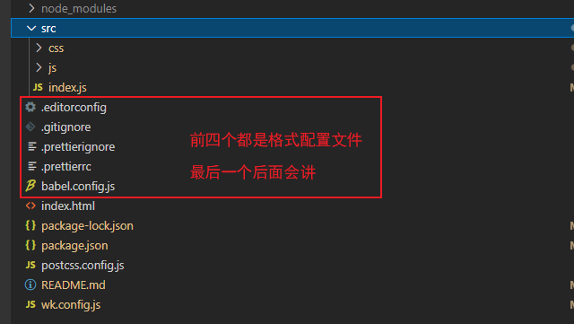
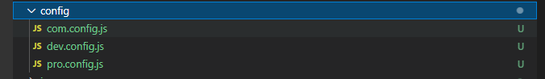
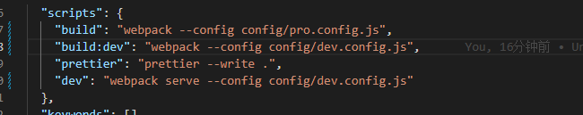

# `webpak`测试用例总结

本文按照之前学习的 [`webpack`](https://github.com/wczy-ao/StudyNotes/tree/main/fe_zero_to_one/webpack)知识做了一系列的测试用例，代码可以按照`src`文件学习；这份代码用的依赖全部是目前最新的稳定版本版、如果有问题可以联系我。

## 1：安装、样式

### 安装

```
npm init -y
npm install webpack webpack-cli -D
```

### 样式

- 目录结构

  

- 如上图所说增加配置文件 wk.config.js；并且修改脚本

  ```json
  "scripts": {
     "build": "webpack --config wk.config.js",
   },
  ```

- 配置入口出口、样式`loader`

  `wk.config.js`

  ```js
  const path = require('path')
  
  module.exports = {
    
    // 指定入口文件
    entry: "./src/index.js",
    // 指定出口文件
    output: {
      path: path.resolve(__dirname, './build'), // 绝对路径,
      publicPath: "/",
      filename: 'boundle.js'
    },
    module: {
      rules: [{
          test: /\.css$/,
          use: [
            "style-loader",
            "css-loader",
            {
              loader: 'postcss-loader',
              options: {
                postcssOptions: {
                  plugins: [
                    [
                      'autoprefixer',
                      {
                        // 选项
                      },
                    ],
                  ],
                },
              },
            },
          ]
        },
        {
          test: /\.less$/,
          use: [
            "style-loader",
            "css-loader",
            "less-loader"
          ]
        }
      ]
    }
  }
  
  ```

- 配置 `postcss` 预设

  `postcss.config.js`

  ```JSON
  module.exports = {
    plugins: [require('postcss-preset-env')]
  }
  ```

  

## 2：plugins、`devtool`

`wk.config.js`

```js
const path = require('path')

const HtmlWebpackPlugin = require('html-webpack-plugin');
const {
  CleanWebpackPlugin
} = require('clean-webpack-plugin');

module.exports = {
  // devtool: "eval-source-map",
  // 指定入口文件
  entry: "./src/index.js",
  // 指定出口文件
  output: {
    path: path.resolve(__dirname, './build'), // 绝对路径,
    publicPath: "/",
    filename: 'boundle.js'
  },
  module: {
    rules: [{
        test: /\.css$/,
        use: [
          "style-loader",
          "css-loader",
          {
            loader: 'postcss-loader',
            options: {
              postcssOptions: {
                plugins: [
                  [
                    'autoprefixer',
                    {
                      // 选项
                    },
                  ],
                ],
              },
            },
          },
        ]
      },
      {
        test: /\.less$/,
        use: [
          "style-loader",
          "css-loader",
          "less-loader"
        ]
      }
    ]
  },
  plugins: [
    new HtmlWebpackPlugin({
      template: './index.html'
    }),
    new CleanWebpackPlugin(),
  ],
}

```


### 3：HMR、`devServer`

`wk.config.js`

```js
const path = require('path')

const HtmlWebpackPlugin = require('html-webpack-plugin');
const {
  CleanWebpackPlugin
} = require('clean-webpack-plugin');

const webpack = require('webpack')

module.exports = {
  mode: "development",
  target: 'web',
  // devtool: "eval-source-map",
  // 指定入口文件
  entry: "./src/index.js",
  // 指定出口文件
  output: {
    path: path.resolve(__dirname, './build'), // 绝对路径,
    publicPath: "/",
    filename: 'boundle.js'
  },
  module: {
    rules: [{
        test: /\.css$/,
        use: [
          "style-loader",
          "css-loader",
          {
            loader: 'postcss-loader',
            options: {
              postcssOptions: {
                plugins: [
                  [
                    'autoprefixer',
                    {
                      // 选项
                    },
                  ],
                ],
              },
            },
          },
        ]
      },
      {
        test: /\.less$/,
        use: [
          "style-loader",
          "css-loader",
          "less-loader"
        ]
      }
    ]
  },
  plugins: [
    new HtmlWebpackPlugin({
      template: './index.html'
    }),
    new CleanWebpackPlugin(),
    new webpack.HotModuleReplacementPlugin()
  ],
  devServer: {
    static: {
      directory: path.join(__dirname, '/'),
    },
    port: 7777,
    open: true,
    compress: true,
  }
}

```

## 4：babel、预设、`polyfill`

`babel.config.js`

```js
// 与wk.config.js 下面的配置二选一
module.exports = {
  presets: [
    [
      '@babel/preset-env',
      {
        useBuiltIns: 'usage' // 实现按需加载
      }
    ]
  ]
}

```

`wk.config.js`

```js
const path = require('path')

const HtmlWebpackPlugin = require('html-webpack-plugin');
const {
  CleanWebpackPlugin
} = require('clean-webpack-plugin');

const webpack = require('webpack')

module.exports = {
  mode: "development",
  target: 'web',
  // devtool: "eval-source-map",
  // 指定入口文件
  entry: "./src/index.js",
  // 指定出口文件
  output: {
    path: path.resolve(__dirname, './build'), // 绝对路径,
    publicPath: "/",
    filename: 'boundle.js'
  },
  module: {
    rules: [{
        test: /\.css$/,
        use: [
          "style-loader",
          "css-loader",
          {
            loader: 'postcss-loader',
            options: {
              postcssOptions: {
                plugins: [
                  [
                    'autoprefixer',
                    {
                      // 选项
                    },
                  ],
                ],
              },
            },
          },
        ]
      },
      {
        test: /\.less$/,
        use: [
          "style-loader",
          "css-loader",
          "less-loader"
        ]
      },
      {
        test: /\m?.js$/,
        loader: "babel-loader",
        // use: [
        //   {
        //     loader: "babel-loader",
        //     options: {
        //       presets: [
        //         [
        //           "@babel/preset-env",
        //           {
        //             useBuiltIns: "usage", // 实现按需加载
        //           }
        //         ]
        //       ]
        //     }
        //   }
        // ],
        exclude: /node_modules/
      },

    ]
  },
  plugins: [
    new HtmlWebpackPlugin({
      template: './index.html'
    }),
    new CleanWebpackPlugin(),
    new webpack.HotModuleReplacementPlugin()
  ],
  devServer: {
    static: {
      directory: path.join(__dirname, '/'),
    },
    port: 7777,
    open: true,
    compress: true,
  },
  optimization: {
    usedExports: true // tree shaking
  }
}

```


## 5：打包模式



脚本调整



## 6：优化

> 两个优化思路手段——打包体积、打包速度，一个优化目标——加快网页加载速度；

### 优化手段

#### 打包体积

- moment 去掉不需要的时区

```js
// 这是webpack5的写法，之前的是 new webpack.IgnorePlugin(/^\.\/locale$/, /moment$/)
plugins: [
    new webpack.IgnorePlugin({
      resourceRegExp: /^\.\/locale$/,
      contextRegExp: /moment$/
    })
  ],
```

- 生产环境 `treeshaking`

- 压缩代码 `TerserPlugin`

- gzip压缩 `CompressionPlugin` 

  

#### 打包速度

- 多进程打包 `TerserPlugin` `happyPack` `ParallelUglifyPlugin`  

- DLL

#### 网页加载速度

- 分包 `splitChunks`
- 小图片使用 `url-loader`
- output 输出文件名使用 hash值、以免后续的上线重新下载资源